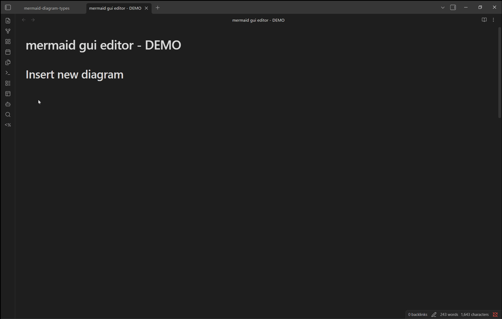
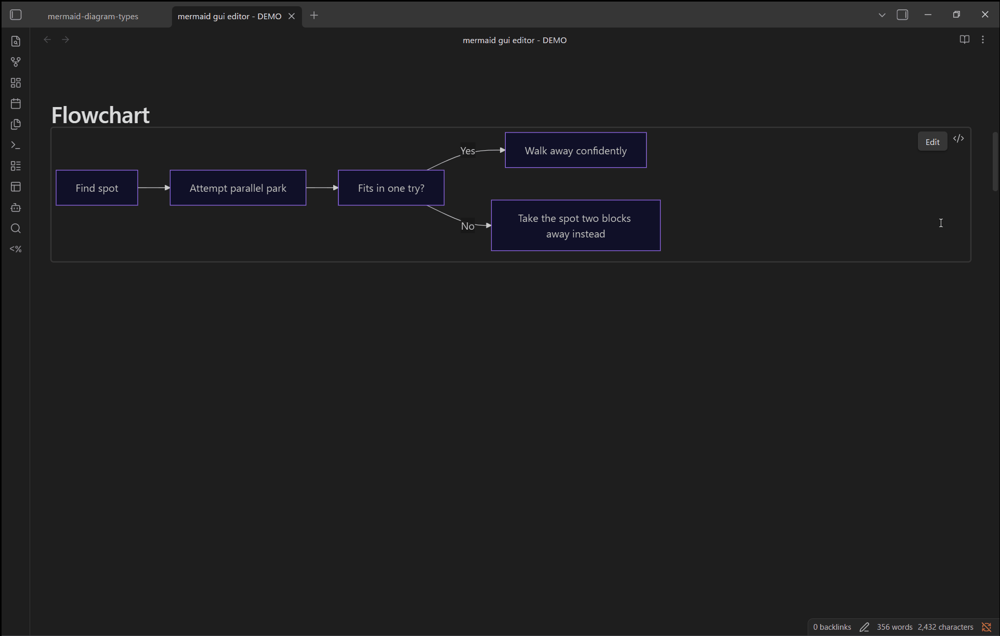
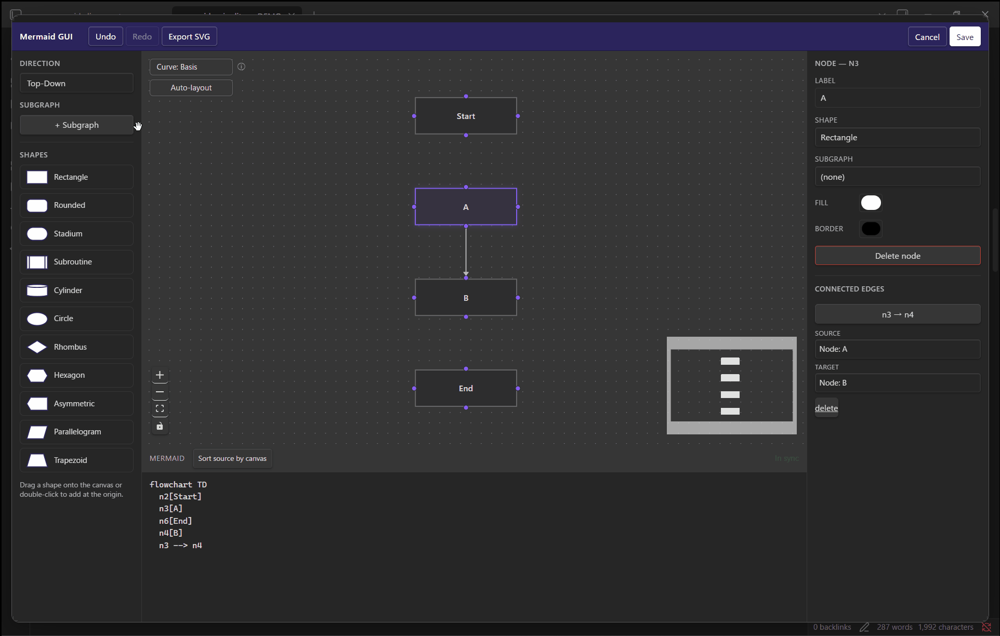
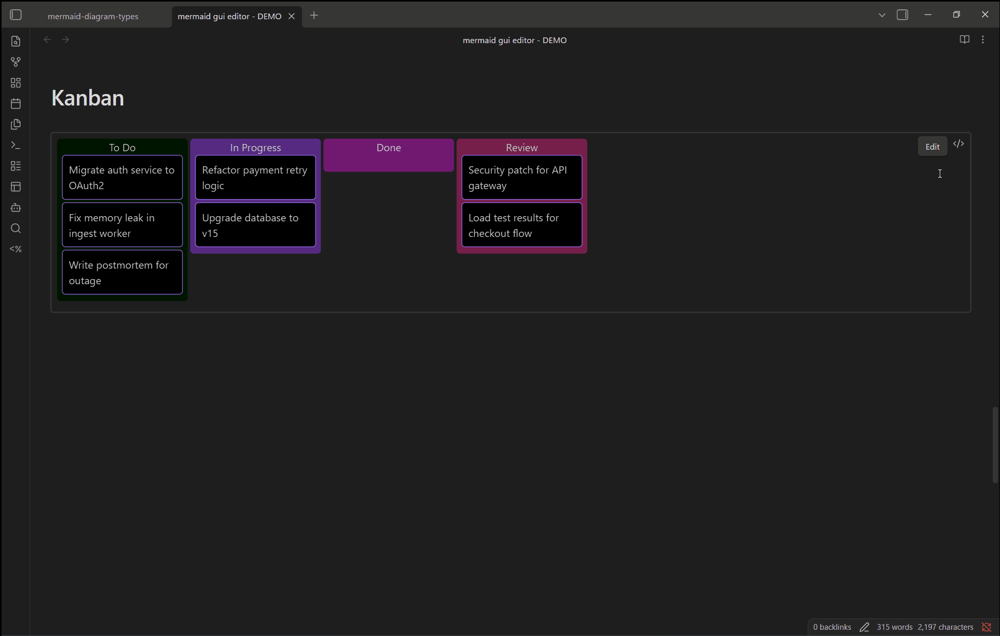
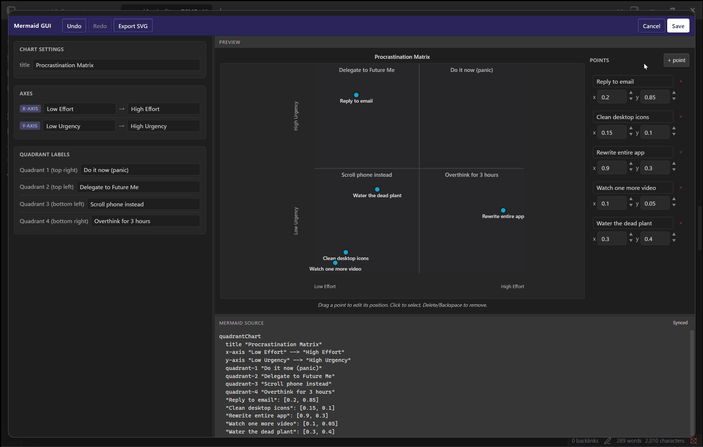
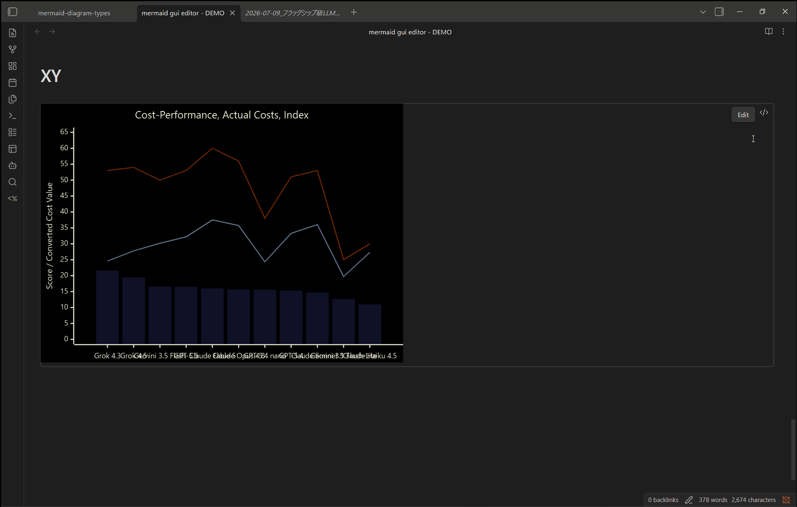

# Mermaid GUI Editor for Obsidian

Edit Mermaid diagrams — flowcharts, sequence diagrams, class diagrams, Gantt charts, kanban boards, and more — with a visual GUI editor, right inside your Obsidian notes. Everything is saved back as **plain Mermaid text**, so your notes stay portable and readable with any other Markdown/Mermaid tool.

## What it does

This plugin adds an **Edit** button to every `` ```mermaid `` code block — in Reading view, in Live Preview, and in Source mode. Clicking it opens a modal with a diagram-specific GUI editor: some diagram types (flowchart, Gantt, kanban, quadrant, XY chart) get a fully interactive canvas you drag and drop directly; the rest (sequence, class, pie, and so on) get a structured form editor next to a live preview that updates as you type. Either way, no hand-written Mermaid syntax is required. Live Preview is where most people will use this day to day, since it's Obsidian's default editing view.

Saving writes back **only the fence content that was edited**; the rest of the note is untouched. Node coordinates and other GUI-only state live for the session only and are never written to the file, so the Mermaid source stays exactly what you'd expect from standard Mermaid — no proprietary metadata, no lock-in.

## Demo

| | |
| --- | --- |
|  Insert a new diagram from the template picker |  Flowchart: edit node shapes directly on the canvas |
|  Flowchart: subgraphs, auto-layout, and the connected-edges inspector |  Kanban: drag-and-drop cards and columns |
|  Quadrant chart: drag points, source stays in sync |  XY chart: bar + line series, editable inline |

## Features

- **Edit button on every mermaid block**, in Reading view, Live Preview, and Source mode alike, plus a command-palette / right-click action to edit the block under your cursor
- **Insert new diagram** — pick a diagram type from a template picker and start building with the GUI immediately (command palette or editor context menu)
- Diagram-specific GUI editors: interactive canvas for flowcharts, draggable bars for Gantt, a full drag-and-drop board for kanban, direct point-dragging for quadrant/XY charts, and structured form editors with a live preview for the rest
- **Non-destructive round-trip** — syntax the parser doesn't understand yet (`classDef`, `style`, `linkStyle`, `click`, …) is preserved verbatim instead of being dropped
- Undo / Redo and SVG export, consistent across every editor
- Follows your Obsidian theme (light/dark, and community themes) automatically
- Unsupported diagram types still get a plain source-text editor as a fallback, so nothing is ever locked out of editing

## Supported diagram types

| Diagram type | Keyword | GUI editor |
| --- | --- | --- |
| Flowchart | `flowchart` / `graph` | ✅ Interactive canvas |
| Quadrant chart | `quadrantChart` | ✅ Interactive canvas |
| XY chart | `xychart-beta` | ✅ Interactive canvas |
| Gantt chart | `gantt` | ✅ Interactive canvas |
| Kanban board | `kanban` | ✅ Interactive canvas |
| Sequence diagram | `sequenceDiagram` | ✅ Form + live preview |
| Class diagram | `classDiagram` | ✅ Form + live preview |
| State diagram | `stateDiagram-v2` / `stateDiagram` | ✅ Form + live preview |
| Pie chart | `pie` | ✅ Form + live preview |
| Sankey diagram | `sankey-beta` | ✅ Form + live preview |
| Timeline | `timeline` | ✅ Form + live preview |
| ER diagram | `erDiagram` | ✅ Form + live preview |
| Mindmap | `mindmap` | ✅ Form + live preview |
| User journey | `journey` | ✅ Form + live preview |
| Architecture diagram | `architecture-beta` | ✅ Form + live preview |
| Block diagram | `block-beta` | ✅ Form + live preview |
| Radar chart | `radar-beta` | ✅ Form, but no live preview (Obsidian's bundled Mermaid doesn't render it) |
| Treemap / Venn diagram | `treemap-beta` / `venn-beta` | ⚠️ Source-only (structured data, no visual canvas or form yet) |
| Anything else | — | ⚠️ Plain source-text editor |

## How to use

**Edit an existing diagram**
1. Open a note containing a `` ```mermaid `` block — Reading view, Live Preview, and Source mode all work.
2. Click the **Edit** button that appears over the diagram (or its rendered position in Live Preview) — or, with your cursor inside the block, right-click and choose **Edit**, or run **"Edit current Mermaid block"** from the command palette.
3. Make your changes in the GUI editor, then **Save**. Only that block is rewritten.

**Create a new diagram**
1. Open the command palette and run **"Insert new Mermaid diagram (GUI)"**, or right-click in the editor and pick the same action.
2. Choose a diagram type from the template picker.
3. Build it with the GUI, then **Save** to insert a new `` ```mermaid `` fence at your cursor.

## Installation

This plugin is not yet in the Obsidian community plugin directory. Until it's listed, install it manually:

1. Clone this repository and run `npm install && npm run build` (see [Development](#development)) to produce `main.js` and `styles.css`.
2. Copy `main.js`, `styles.css`, and `manifest.json` into `<vault>/.obsidian/plugins/mermaid-gui-editor/`.
3. In Obsidian, go to **Settings → Community plugins**, turn off Restricted Mode if needed, and enable **Mermaid GUI Editor**.

## Privacy & safety

- **No network access.** The plugin never sends any data anywhere — it only reads and writes the note you're editing, locally.
- **Scoped writes.** Saving only rewrites the exact fence you opened; before writing, the plugin re-verifies the fence's start/end lines so a note edited elsewhere while the modal was open can't be corrupted.
- **No proprietary state in your files.** Node positions and other GUI-only data exist only for the editing session and are never persisted to the note — what's saved is standard Mermaid text, nothing else.

## Known limitations

- Desktop only (`isDesktopOnly: true`) — not available on Obsidian Mobile.
- `radar-beta` has a GUI editor, but Obsidian's bundled Mermaid doesn't render that diagram type, so no live preview is shown. `treemap-beta` and `venn-beta` are source-only editors (no visual canvas) for the same underlying reason.
- Editing always opens a modal — there's no fully inline, in-place GUI woven directly into the Live Preview text yet (it would have to contend with CM6 for control of the editor, IME composition, and undo history).
- Index-based `linkStyle N` declarations aren't tracked structurally, so reordering edges can shift which style applies to which edge.
- The flowchart **Curve** setting (`%%{init: {"flowchart": {"curve": "..."}}}%%`) may not visibly affect rendering, depending on the Mermaid version bundled with your Obsidian install. This is a known, currently unresolved upstream Mermaid bug in the flowchart-v2/dagre-wrapper renderer ([mermaid-js/mermaid#6193](https://github.com/mermaid-js/mermaid/issues/6193), fix in progress via PR #6408) — the Mermaid saved by this plugin is correct either way, and the setting will take visible effect once Obsidian ships a Mermaid version with the upstream fix.

## Development

```bash
npm install
npm run dev        # esbuild watch — reload Obsidian after main.js/styles.css rebuild
npm run build       # typecheck + production bundle
npm run typecheck
npm run test
npm run test:watch
```

For local testing, symlink the repo into your vault's plugins folder instead of copying files on every change:

```bash
# Windows (PowerShell, run as Administrator)
New-Item -ItemType Junction `
  -Path "<vault>\.obsidian\plugins\mermaid-gui-editor" `
  -Target "<repo>\."
```

Run `npm run dev` in the repo and reload Obsidian (`Ctrl/Cmd+R`) to pick up changes.

## License

[MIT](LICENSE)
