# Mermaid 図種別リファレンス

Mermaid 公式（<https://mermaid.js.org/syntax/）が提供する全図種別を網羅したリファレンス。>\
コードフェンスに記述するキーワードと最小サンプルを記載する。

***

## 安定版（Stable）

### 1. Flowchart — フローチャート

> **GUI対応:** ✅ Flowchart GUI 実装済み

プロセスやロジックをノードと有向エッジで表現する。`flowchart`（推奨）と `graph`（旧名）の両方が使用可能。\
方向は `TD`（上→下）/ `LR`（左→右）/ `RL` / `BT` から選択。

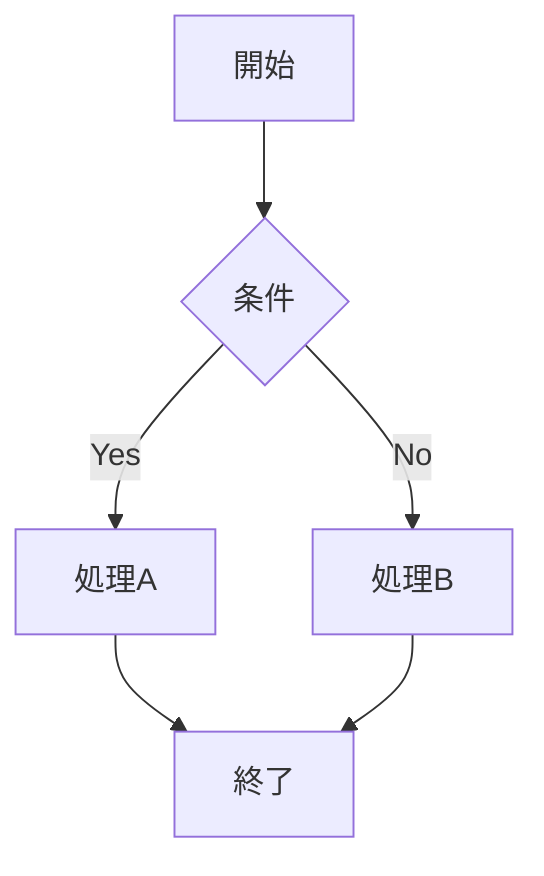
```mermaid
flowchart TD
  A[開始]
  B{条件}
  C[処理A]
  D[処理B]
  E[終了]
  A --> B
  B -- Yes --> C
  B -- No --> D
  C --> E
  D --> E
```

***

### 2. Sequence Diagram — シーケンス図

> **GUI対応:** ✅ 実装済み（Phase 4 完了）

参加者間のメッセージのやり取りと時系列順を表現するインタラクション図。

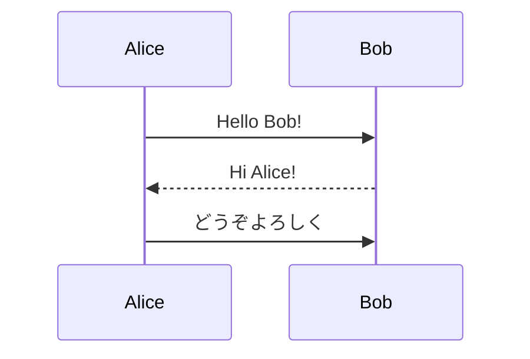
```mermaid
sequenceDiagram
    participant Alice
    participant Bob
    Alice->>Bob: Hello Bob!
    Bob-->>Alice: Hi Alice!
    Alice->>Bob: どうぞよろしく
```

***

### 3. Class Diagram — クラス図

> **GUI対応:** ✅ 実装済み（Phase 5 完了）

OOP のクラス構造・属性・メソッド・継承・関連を表現する UML 静的構造図。

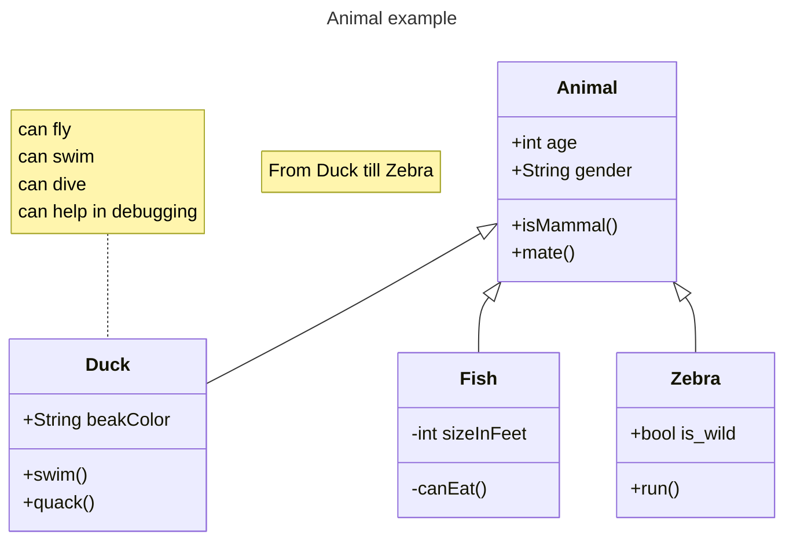
```mermaid
---
title: Animal example
---
classDiagram
    note "From Duck till Zebra"
    Animal <|-- Duck
    note for Duck "can fly<br>can swim<br>can dive<br>can help in debugging"
    Animal <|-- Fish
    Animal <|-- Zebra
    Animal : +int age
    Animal : +String gender
    Animal: +isMammal()
    Animal: +mate()
    class Duck{
        +String beakColor
        +swim()
        +quack()
    }
    class Fish{
        -int sizeInFeet
        -canEat()
    }
    class Zebra{
        +bool is_wild
        +run()
    }
```

***

### 4. State Diagram — 状態遷移図

> **GUI対応:** ✅ 実装済み（Phase 5 完了）

システムの状態と、イベントによる状態間遷移を表現する。`stateDiagram-v2` が現行版。

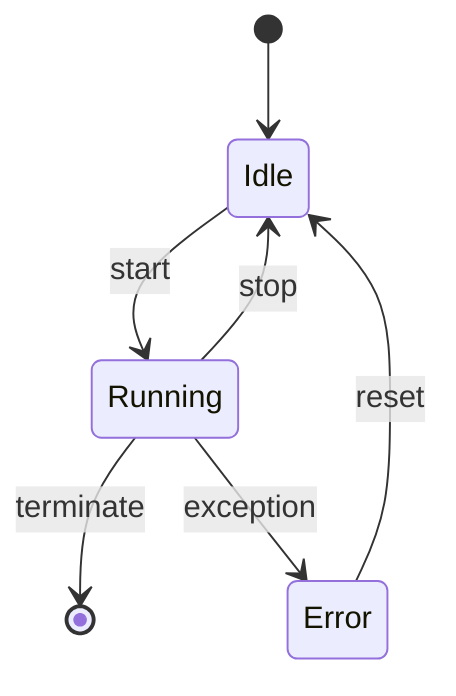
```mermaid
stateDiagram-v2
    [*] --> Idle
    Idle --> Running : start
    Running --> Idle : stop
    Running --> [*] : terminate
    Running --> Error : exception
    Error --> Idle : reset
```

***

### 5. Entity Relationship Diagram — ER 図

> **GUI対応予定:** 🔵 実装対象

データエンティティ間の関係をクロウズフット記法で表現するデータモデル図。

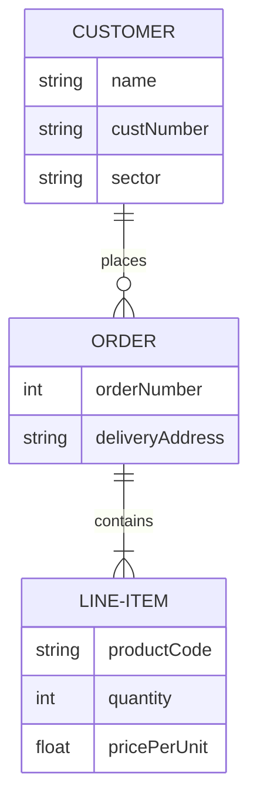
```mermaid
erDiagram
    CUSTOMER ||--o{ ORDER : places
    CUSTOMER {
        string name
        string custNumber
        string sector
    }
    ORDER ||--|{ LINE-ITEM : contains
    ORDER {
        int orderNumber
        string deliveryAddress
    }
    LINE-ITEM {
        string productCode
        int quantity
        float pricePerUnit
    }
```

***

### 6. User Journey — ユーザージャーニー

> **GUI対応予定:** 🔵 実装対象

ユーザーが特定タスクを完了するまでのステップと満足度スコアを可視化する。

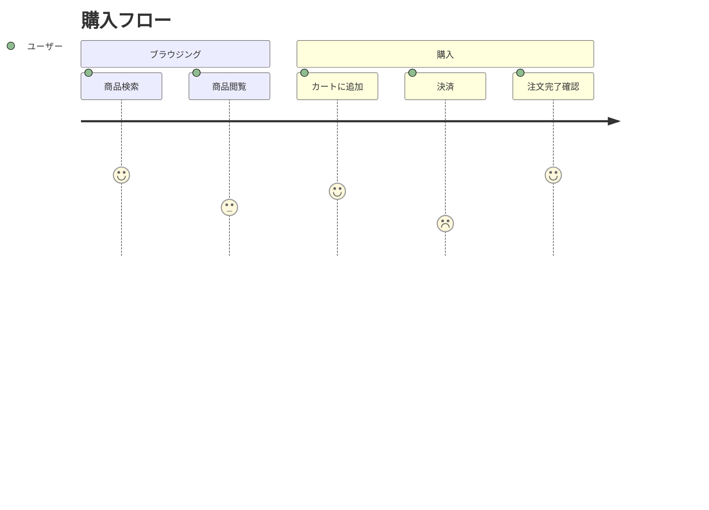
```mermaid
journey
    title 購入フロー
    section ブラウジング
      商品検索: 5: ユーザー
      商品閲覧: 3: ユーザー
    section 購入
      カートに追加: 4: ユーザー
      決済: 2: ユーザー
      注文完了確認: 5: ユーザー
```

***

### 7. Gantt — ガントチャート

> **GUI対応:** ✅ 実装済み（Phase 7 完了）

タスク・期間・依存関係・マイルストーンをバーで表示するプロジェクト管理図。

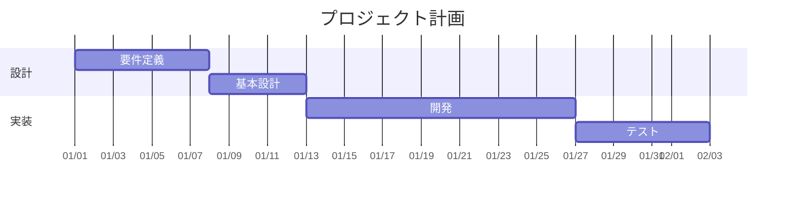
```mermaid
gantt
    title プロジェクト計画
    dateFormat YYYY-MM-DD
    axisFormat %m/%d
    section 設計
    要件定義 :a1, 2024-01-01, 7d
    基本設計 :a2, after a1, 5d
    section 実装
    開発 :a3, after a2, 14d
    テスト :a4, after a3, 7d
```

***

### 8. Pie Chart — 円グラフ

> **GUI対応:** ✅ 実装済み（Phase 6 完了）

全体に対する各カテゴリの割合を扇形で表現する。

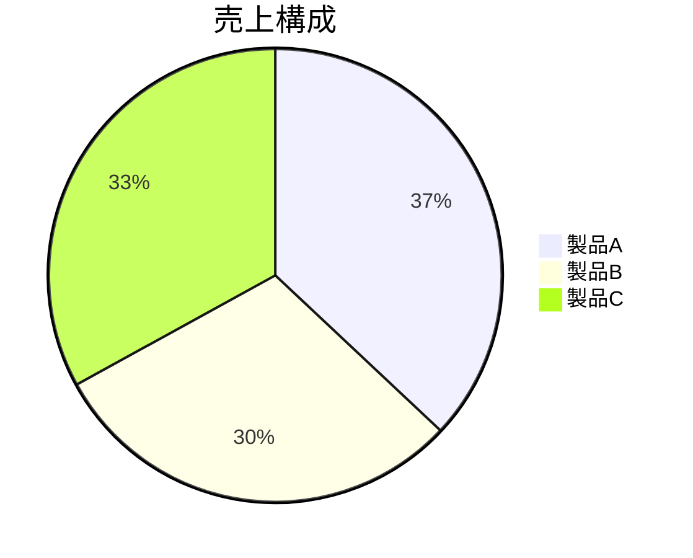
```mermaid
pie title 売上構成
  "製品A" : 37
  "製品B" : 30
  "製品C" : 33
```

***

### 9. Quadrant Chart — 象限チャート

> **GUI対応:** ✅ 実装済み（Phase 6 完了）

2 軸の座標空間にデータポイントを配置し、4 象限に分類して優先度・重要度を分析する。

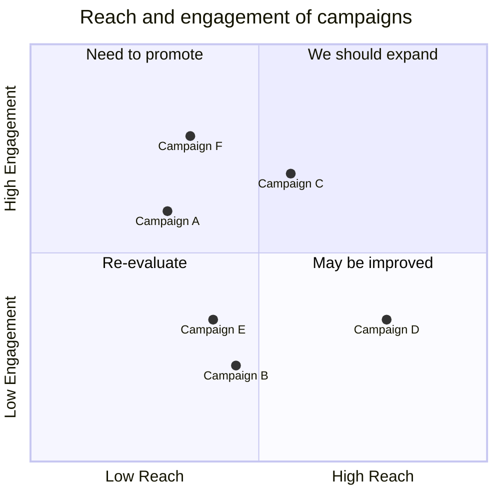
```mermaid
quadrantChart
    title Reach and engagement of campaigns
    x-axis Low Reach --> High Reach
    y-axis Low Engagement --> High Engagement
    quadrant-1 We should expand
    quadrant-2 Need to promote
    quadrant-3 Re-evaluate
    quadrant-4 May be improved
    Campaign A: [0.3, 0.6]
    Campaign B: [0.45, 0.23]
    Campaign C: [0.57, 0.69]
    Campaign D: [0.78, 0.34]
    Campaign E: [0.40, 0.34]
    Campaign F: [0.35, 0.78]
```

***

### 10. Requirement Diagram — 要件図

要件と成果物・テスト要素などとの関係（満足・トレース・精緻化・検証）を表現する。

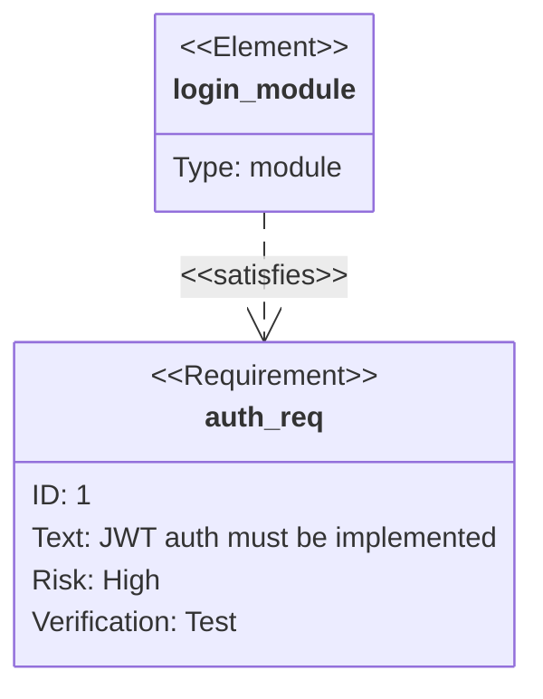
```mermaid
requirementDiagram
    requirement auth_req {
    id: 1
    text: JWT auth must be implemented
    risk: high
    verifymethod: test
    }
    element login_module {
    type: module
    }
    login_module - satisfies -> auth_req
```

***

### 11. GitGraph — Git グラフ

コミット履歴・ブランチ・マージ・チェックアウトを可視化する。

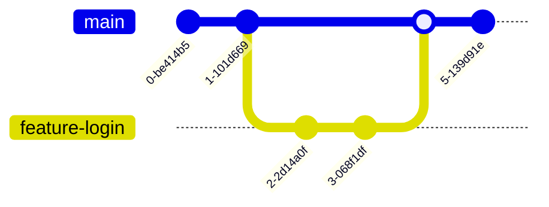
```mermaid
gitGraph
    commit
    commit
    branch feature-login
    commit
    commit
    checkout main
    merge feature-login
    commit
```

***

### 12. Mindmap — マインドマップ

> **GUI対応予定:** 🔵 実装対象

中心テーマから派生する情報を階層的に可視化する。インデントで階層を表現。

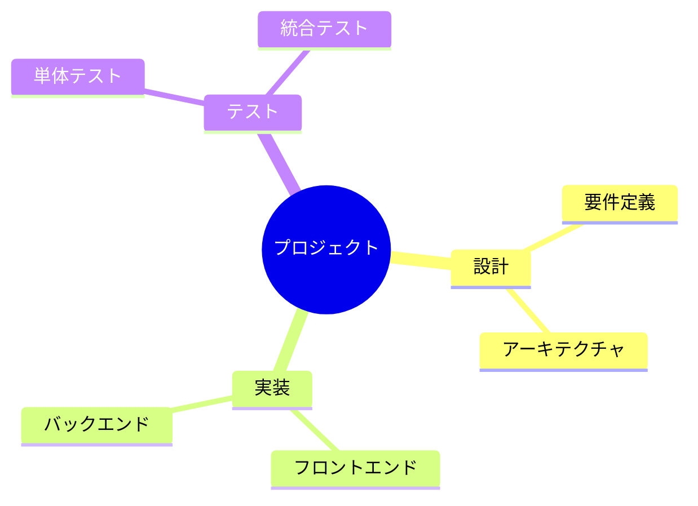
```mermaid
mindmap
  root((プロジェクト))
    設計
      要件定義
      アーキテクチャ
    実装
      フロントエンド
      バックエンド
    テスト
      単体テスト
      統合テスト
```

***

### 13. Timeline — タイムライン

> **GUI対応:** ✅ 実装済み（Phase 7 完了）

時系列でイベントを並べる年表図。同一時期に複数イベントを記述可能。

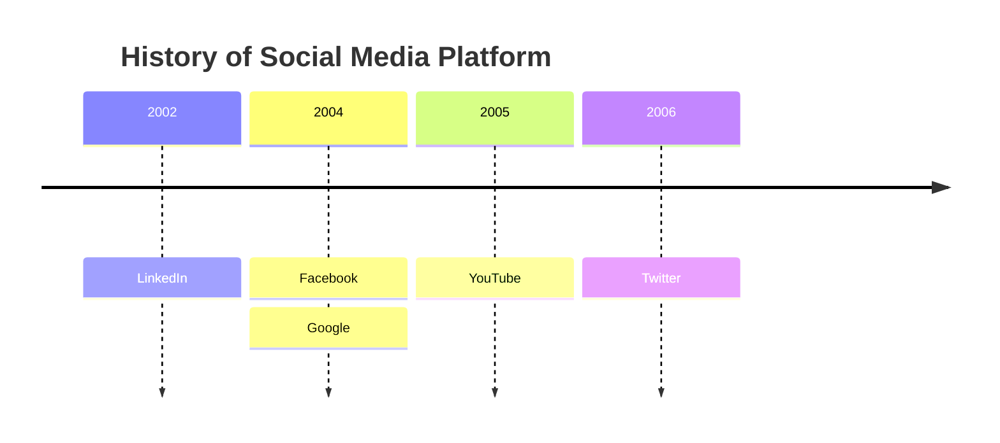
```mermaid
timeline
    title History of Social Media Platform
    2002 : LinkedIn
    2004 : Facebook
         : Google
    2005 : YouTube
    2006 : Twitter
```

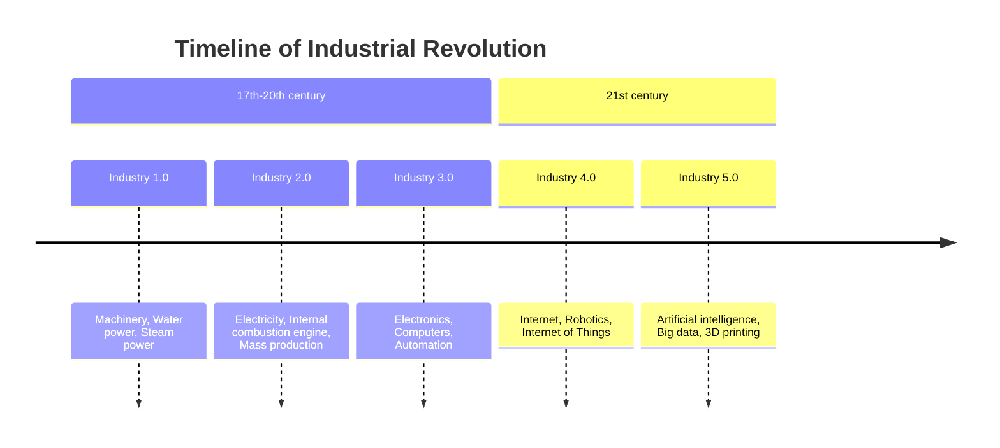
```mermaid
timeline
    title Timeline of Industrial Revolution
    section 17th-20th century
        Industry 1.0 : Machinery, Water power, Steam <br>power
        Industry 2.0 : Electricity, Internal combustion engine, Mass production
        Industry 3.0 : Electronics, Computers, Automation
    section 21st century
        Industry 4.0 : Internet, Robotics, Internet of Things
        Industry 5.0 : Artificial intelligence, Big data, 3D printing
```

***

### 14. ZenUML — ZenUML シーケンス図

> **Obsidian:** ❌ 非対応

シーケンス図の代替構文。同期（`->`）・非同期（`->>`）メッセージを簡潔な記法で記述できる。

```text
zenuml
    title Demo
    Alice->John: Hello John, how are you?
    John->Alice: Great!
    Alice->John: See you later!
```

> **Note:** ZenUML は Mermaid v10.3+ で追加。VS Code の Mermaid プレビュー拡張がその版未満の場合はレンダリングされない。

***

### 15. Kanban — カンバン

ワークフローのカラムとタスクカードを表示するカンバンボード。

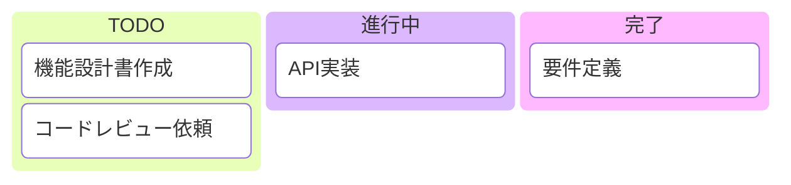
```mermaid
kanban
    column todo[TODO]
        task1[機能設計書作成]
        task2[コードレビュー依頼]
    column inprogress[進行中]
        task3[API実装]
    column done[完了]
        task4[要件定義]
```

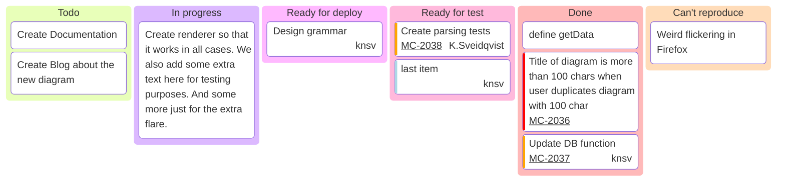
```mermaid
---
config:
  kanban:
    ticketBaseUrl: 'https://mermaidchart.atlassian.net/browse/#TICKET#'
---
kanban
  Todo
    [Create Documentation]
    docs[Create Blog about the new diagram]
  [In progress]
    id6[Create renderer so that it works in all cases. We also add some extra text here for testing purposes. And some more just for the extra flare.]
  id9[Ready for deploy]
    id8[Design grammar]@{ assigned: 'knsv' }
  id10[Ready for test]
    id4[Create parsing tests]@{ ticket: MC-2038, assigned: 'K.Sveidqvist', priority: 'High' }
    id66[last item]@{ priority: 'Very Low', assigned: 'knsv' }
  id11[Done]
    id5[define getData]
    id2[Title of diagram is more than 100 chars when user duplicates diagram with 100 char]@{ ticket: MC-2036, priority: 'Very High'}
    id3[Update DB function]@{ ticket: MC-2037, assigned: knsv, priority: 'High' }

  id12[Can't reproduce]
    id3[Weird flickering in Firefox]
```

***

### 16. Ishikawa Diagram — 石川図（フィッシュボーン図）

> **Obsidian:** ❌ 非対応

問題に対する原因・副原因を階層的に整理する特性要因図。根本原因分析（RCA）に使用。

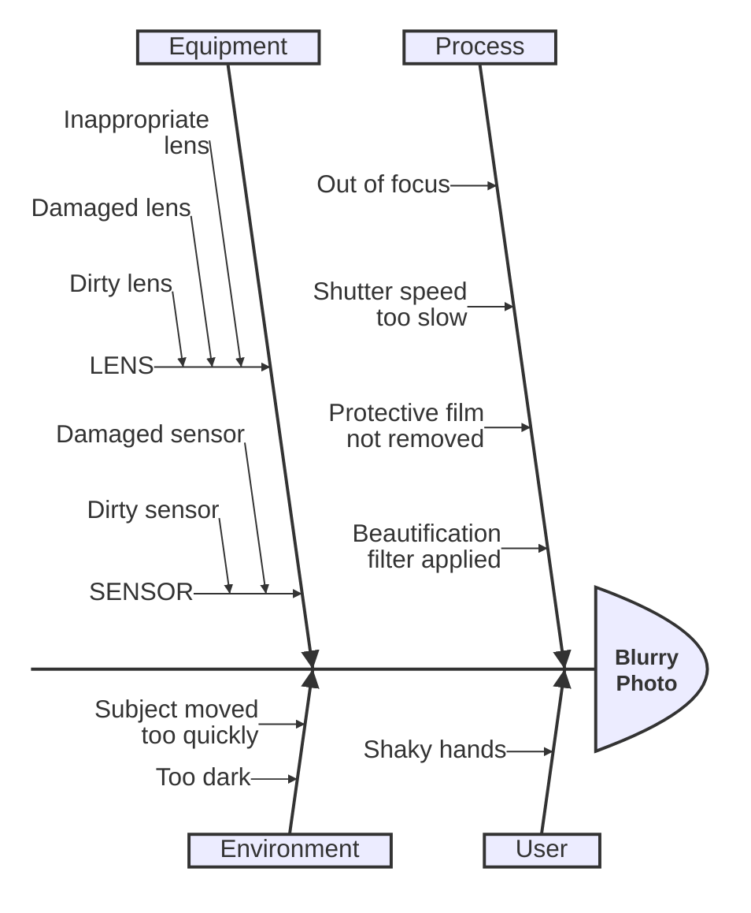
```mermaid
ishikawa-beta
    Blurry Photo
    Process
        Out of focus
        Shutter speed too slow
        Protective film not removed
        Beautification filter applied
    User
        Shaky hands
    Equipment
        LENS
            Inappropriate lens
            Damaged lens
            Dirty lens
        SENSOR
            Damaged sensor
            Dirty sensor
    Environment
        Subject moved too quickly
        Too dark
```

***

### 17. Event Modeling — イベントモデリング図

> **Obsidian:** ❌ 非対応

イベントドリブンシステムの UI・コマンド・イベント・リードモデルを時系列レーンで表現する（v11.15.0+）。

```text
eventmodeling
    tf 01 ui CartUI
    tf 02 cmd AddItem
    tf 03 evt ItemAdded
    tf 04 rm CartView
    CartUI -->> AddItem: ユーザーがカートに追加
    AddItem -->> ItemAdded: コマンド発行
    ItemAdded -->> CartView: ビュー更新
```

> **Note:** `eventmodeling` は Mermaid v11.15.0+ で追加。VS Code の Mermaid プレビュー拡張が未対応の場合はレンダリングされない。

***

## 実験的（Beta）

> キーワードに `-beta` サフィックスが付く図は実験的機能。構文・仕様は将来変更される可能性がある。

***

### 18. Sankey Diagram — サンキー図 `sankey-beta`

> **GUI対応:** ✅ 実装済み（Phase 6 完了）

エネルギー・資金・物流などのフロー量を帯の太さで表現する。データは CSV 形式で記述。

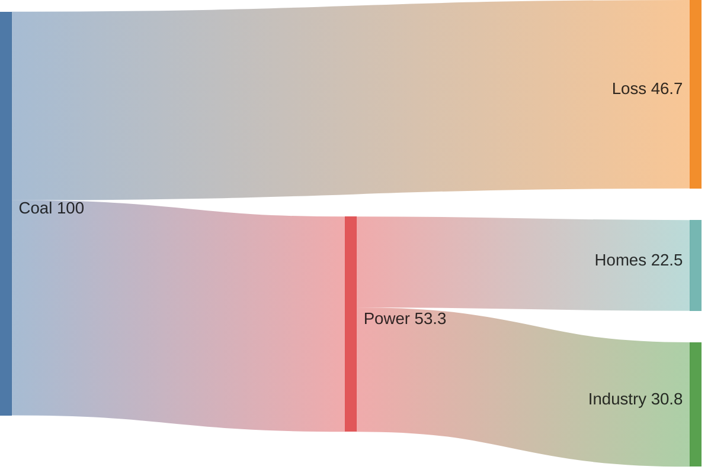
```mermaid
sankey-beta
Coal,Loss,46.7
Coal,Power,53.3
Power,Homes,22.5
Power,Industry,30.8
```

***

### 19. XY Chart — XY チャート `xychart-beta`

> **GUI対応:** ✅ 実装済み（Phase 6 完了）

棒グラフ・折れ線グラフを X/Y 軸上にプロットするデータ可視化図。

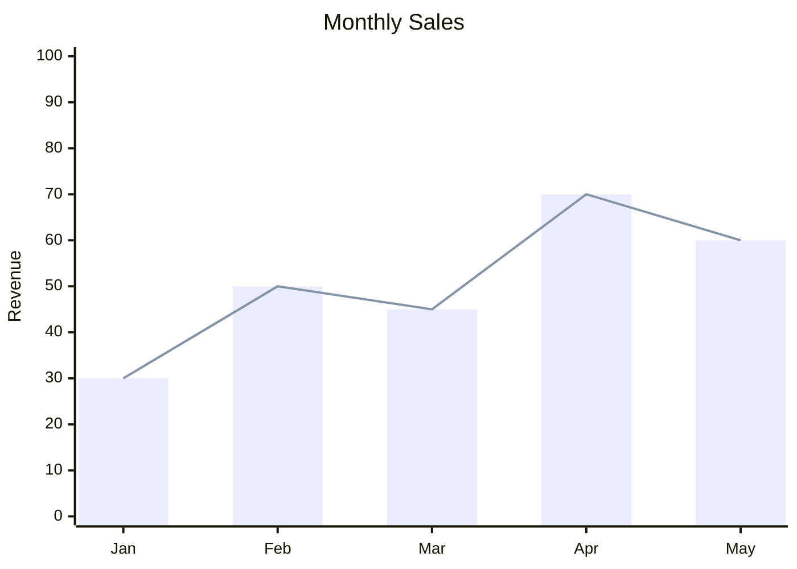
```mermaid
xychart-beta
    title "Monthly Sales"
    x-axis [Jan, Feb, Mar, Apr, May]
    y-axis "Revenue" 0 --> 100
    bar [30, 50, 45, 70, 60]
    line [30, 50, 45, 70, 60]
```

***

### 20. Block Diagram — ブロック図 `block-beta`

> **GUI対応予定:** 🔵 実装対象

ブロック（コンポーネント）の配置とその関係を明示的に制御して表現するシステム設計図。

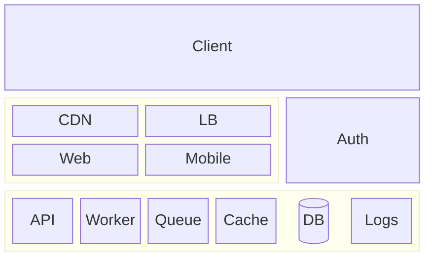
```mermaid
block-beta
    columns 3
    Client["Client"]:3
    block:web:2
        columns 2
        CDN["CDN"] LB["LB"] Web["Web"] Mobile["Mobile"]
    end
    Auth["Auth"]
    block:backend:3
        API["API"] Worker["Worker"] Queue["Queue"] Cache["Cache"] DB[("DB")] Logs["Logs"]
    end
```

***

### 21. Architecture Diagram — アーキテクチャ図 `architecture-beta`

> **GUI対応予定:** 🔵 実装対象

クラウド・CI/CD 環境のサービスとリソース間の関係を表現するインフラ設計図。

```mermaid
architecture-beta
    group api(cloud)[API]

    service db(database)[Database] in api
    service disk1(disk)[Storage] in api
    service disk2(disk)[Storage] in api
    service server(server)[Server] in api

    db:L -- R:server
    disk1:T -- B:server
    disk2:T -- B:db
```

***

### 22. Packet Diagram — パケット図 `packet-beta`

ネットワークプロトコルのパケット構造をビット単位で表現する。

```mermaid
packet-beta
0-15: "Source Port"
16-31: "Destination Port"
32-63: "Sequence Number"
64-95: "Acknowledgment Number"
96-99: "Data Offset"
100-105: "Reserved"
106-111: "Flags"
112-127: "Window Size"
```

***

### 23. Radar Chart — レーダーチャート `radar-beta`

> **GUI対応:** ✅ 実装済み（Phase 6 完了）

> **Obsidian:** ❌ プレビュー非対応（GUI 編集は可能、ただし Obsidian 内では描画されない）

複数の軸（次元）に沿って複数エンティティを比較するスパイダーチャート。

```mermaid
radar-beta
  title Restaurant Comparison
  axis food["Food Quality"], service["Service"], price["Price"]
  axis ambiance["Ambiance"]

  curve a["Restaurant A"]{4, 3, 2, 4}
  curve b["Restaurant B"]{3, 4, 3, 3}
  curve c["Restaurant C"]{2, 3, 4, 2}
  curve d["Restaurant D"]{2, 2, 4, 3}

  graticule polygon
  max 5
```

***

### 24. Venn Diagram — ベン図 `venn-beta`

> **GUI対応予定:** 🔵 実装対象

> **Obsidian:** ❌ 非対応

集合間の包含・交差・和集合などの関係を重なり合う円で表現する。

```mermaid
venn-beta
    set A[JavaScript]
    set B[TypeScript]
    union A,B[JSエコシステム]
```

```mermaid
venn-beta
  set A["Alpha"]:20
    text A1["React"]
    text A2["Design Systems"]
  set B["Beta"]:12
  union A,B["AB"]:3
```

***

### 25. Wardley Map — ウォードリーマップ `wardley-beta`

> **Obsidian:** ❌ 非対応

価値連鎖内のコンポーネントを「可視性（Visibility）」と「進化段階（Evolution）」の 2 軸でプロットする戦略マップ。

```mermaid
wardley-beta
    title オンラインショップ戦略
    component Customer [0.95, 0.63]
    component Website [0.85, 0.69]
    component Database [0.60, 0.55]
    component Infrastructure [0.30, 0.85]
    Customer -> Website
    Website -> Database
    Database -> Infrastructure
```

***

### 26. Treemap — ツリーマップ `treemap-beta`

> **GUI対応予定:** 🔵 実装対象

階層構造を持つデータを、サイズに比例したネスト矩形で表現する。

```mermaid
treemap-beta
"Products"
    "Electronics"
        "Phones": 50
        "Computers": 30
        "Accessories": 20
    "Clothing"
        "Men's": 40
        "Women's": 40
```

```mermaid
---
config:
  treemap:
    valueFormat: '$.1%'
---
treemap-beta
"Market Share"
    "Market X"
        "Company A": 0.35
        "Company B": 0.25
    "Market Y"
        "Company C": 0.15
        "Others": 0.25
```

***

### 27. TreeView — ツリービュー `treeView-beta`

> **Obsidian:** ❌ 非対応

ファイルシステムやディレクトリ構造などの階層ツリーをインデントで表現する（v11.14.0+）。

```mermaid
treeView-beta
    "プロジェクトルート"
        "src"
            "components"
                "Button.tsx"
                "Modal.tsx"
            "utils"
                "parser.ts"
        "docs"
            "README.md"
        "package.json"
```

***

## C4 モデル（実験的）

Simon Brown の C4 モデルに基づく 5 レベルのアーキテクチャ記述図。抽象度の異なる視点でシステムを段階的に掘り下げる。

***

### 28. C4 Context — システムコンテキスト図 `C4Context`

最も高い抽象度。システムとその外部ユーザー・外部システムとの関係を示す。

```mermaid
C4Context
    Person(user, "エンドユーザー", "サービスの利用者")
    System(webApp, "Webシステム", "メインサービス")
    System_Ext(payment, "決済システム", "外部決済API")
    Rel(user, webApp, "使用する", "HTTPS")
    Rel(webApp, payment, "課金する", "REST API")
```

***

### 29. C4 Container — コンテナ図 `C4Container`

システム内の主要コンテナ（アプリ・DB・メッセージキュー等）と相互作用を示す。

```mermaid
C4Container
    Container(webapp, "Webアプリ", "React", "ユーザーインターフェース")
    Container(api, "API サーバー", "Node.js", "ビジネスロジック")
    ContainerDb(db, "データベース", "PostgreSQL", "永続データ")
    Rel(webapp, api, "HTTP/JSON", "HTTPS")
    Rel(api, db, "クエリ実行", "SQL")
```

***

### 30. C4 Component — コンポーネント図 `C4Component`

コンテナ内の主要コンポーネントと依存関係を詳細に示す。

```mermaid
C4Component
    Component(auth, "認証コンポーネント", "JWT検証・発行")
    Component(userRepo, "ユーザーリポジトリ", "DBアクセス")
    Component(notifier, "通知サービス", "メール・Push送信")
    Rel(auth, userRepo, "ユーザー情報照会")
    Rel(auth, notifier, "ログイン通知")
```

***

### 31. C4 Dynamic — ダイナミック図 `C4Dynamic`

特定のシナリオにおけるコンポーネント間の動的な相互作用を番号付き順序で示す。

```mermaid
C4Dynamic
    Person(user, "ユーザー")
    Container(app, "Webアプリ")
    Container(api, "APIサーバー")
    ContainerDb(db, "DB")
    Rel(user, app, "1. ログインリクエスト")
    Rel(app, api, "2. 認証API呼び出し")
    Rel(api, db, "3. ユーザー検索")
    Rel(db, api, "4. ユーザー情報返却")
    Rel(api, app, "5. JWT発行")
    Rel(app, user, "6. ログイン成功")
```

***

### 32. C4 Deployment — デプロイメント図 `C4Deployment`

本番環境・クラウドインフラ上でのコンテナの物理的配置を示す。

```mermaid
C4Deployment
    Deployment_Node(aws, "AWS", "クラウドプロバイダー") {
        Deployment_Node(vpc, "VPC") {
            Deployment_Node(ec2, "EC2インスタンス", "t3.medium") {
                Container(app, "APIサーバー", "Node.js")
            }
            Deployment_Node(rds, "RDS", "PostgreSQL 15") {
                ContainerDb(db, "データベース")
            }
        }
    }
```

***

## 図種別一覧

| #  | 図種別                  | キーワード                 | ステータス | GUI対応                  |
| -- | -------------------- | --------------------- | ----- | ----------------------- |
| 1  | Flowchart            | `flowchart` / `graph` | 安定    | ✅ 実装済み                 |
| 2  | Sequence Diagram     | `sequenceDiagram`     | 安定    | ✅ 実装済み（Phase 4）        |
| 3  | Class Diagram        | `classDiagram`        | 安定    | ✅ 実装済み（Phase 5）        |
| 4  | State Diagram        | `stateDiagram-v2`     | 安定    | ✅ 実装済み（Phase 5）        |
| 5  | ER Diagram           | `erDiagram`           | 安定    | ✅ 実装済み（Phase 8）        |
| 6  | User Journey         | `journey`             | 安定    | ✅ 実装済み（Phase 9）        |
| 7  | Gantt                | `gantt`               | 安定    | ✅ 実装済み（Phase 7）        |
| 8  | Pie Chart            | `pie`                 | 安定    | ✅ 実装済み（Phase 6）        |
| 9  | Quadrant Chart       | `quadrantChart`       | 安定    | ✅ 実装済み（Phase 6）        |
| 10 | Requirement Diagram  | `requirementDiagram`  | 安定    | —                       |
| 11 | GitGraph             | `gitgraph`            | 安定    | —                       |
| 12 | Mindmap              | `mindmap`             | 安定    | ✅ 実装済み（Phase 8）        |
| 13 | Timeline             | `timeline`            | 安定    | ✅ 実装済み（Phase 7）        |
| 14 | ZenUML               | `zenuml`              | 安定    | ❌ Obs非対応              |
| 15 | Kanban               | `kanban`              | 安定    | —                       |
| 16 | Ishikawa Diagram     | `ishikawa`            | 安定    | ❌ Obs非対応              |
| 17 | Event Modeling       | `eventmodeling`       | 安定    | ❌ Obs非対応              |
| 18 | Sankey Diagram       | `sankey-beta`         | Beta  | ✅ 実装済み（Phase 6）        |
| 19 | XY Chart             | `xychart-beta`        | Beta  | ✅ 実装済み（Phase 6）        |
| 20 | Block Diagram        | `block-beta`          | Beta  | ✅ 実装済み（Phase 10）       |
| 21 | Architecture Diagram | `architecture-beta`   | Beta  | ✅ 実装済み（Phase 10）       |
| 22 | Packet Diagram       | `packet-beta`         | Beta  | —                       |
| 23 | Radar Chart          | `radar-beta`          | Beta  | ✅ 実装済み（Phase 6）❌ Obs描画不可 |
| 24 | Venn Diagram         | `venn-beta`           | Beta  | ✅ Source-only（Phase 8）❌ Obs非対応 |
| 25 | Wardley Map          | `wardley-beta`        | Beta  | ❌ Obs非対応              |
| 26 | Treemap              | `treemap-beta`        | Beta  | ✅ Source-only（Phase 8）  |
| 27 | TreeView             | `treeView-beta`       | Beta  | ❌ Obs非対応              |
| 28 | C4 Context           | `C4Context`           | 実験的   | —                       |
| 29 | C4 Container         | `C4Container`         | 実験的   | —                       |
| 30 | C4 Component         | `C4Component`         | 実験的   | —                       |
| 31 | C4 Dynamic           | `C4Dynamic`           | 実験的   | —                       |
| 32 | C4 Deployment        | `C4Deployment`        | 実験的   | —                       |


